## SCUx401CTF2021 逆向部分 WriteUp

[TOC]

### RE1-ez_fps

非常简单的 Unity3D 逆向，点进去之后是一个枪战游戏，解题方法有很多。

#### 解法一

根据题目左上角的提示，打够100个靶子即可获得flag，嗯打：

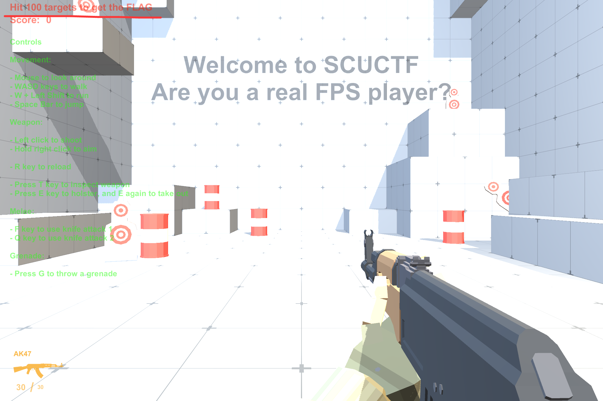

#### 解法二

用 Cheat Engine 修改内存拿到flag：

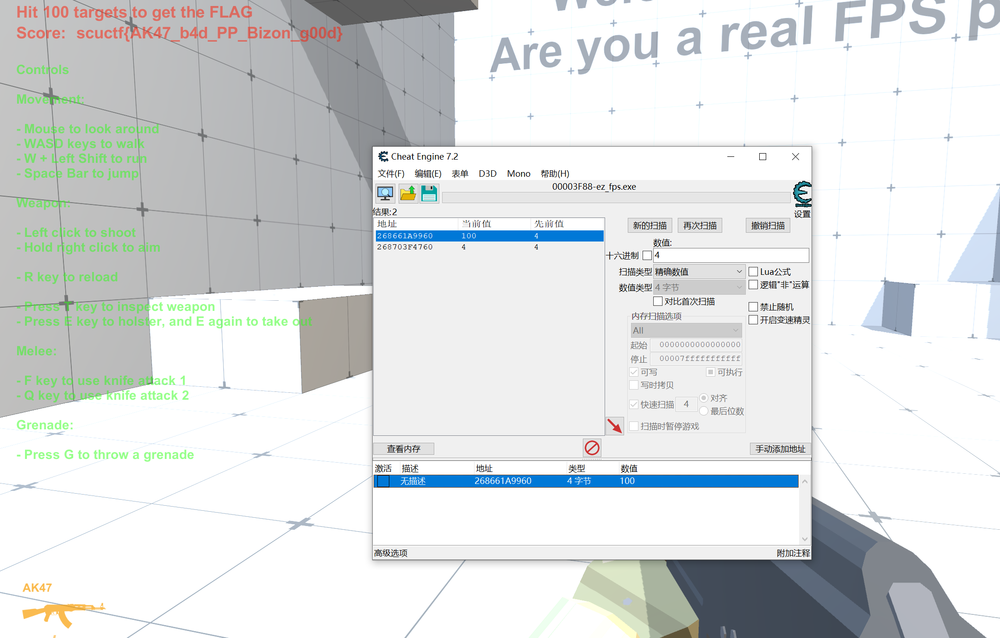

#### 解法三

使用 .Net Reflector 反编译 ez_fps_Data/Managed 目录下的 Assembly-CSharp.dll文件：

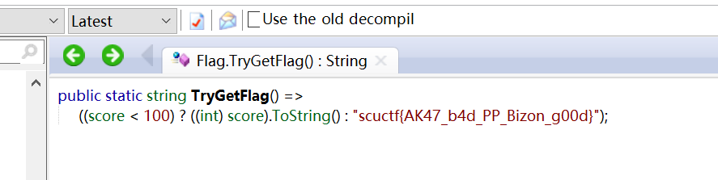

### RE2-pixpix

GetPixel获取坐标(401, 401)处像素的RGB值，可以看到有一个函数被加密了，需要在运行时解密，解密需要用到之前获取的RGB值。也就是说我们要求出正确的RGB值才能拿到flag：

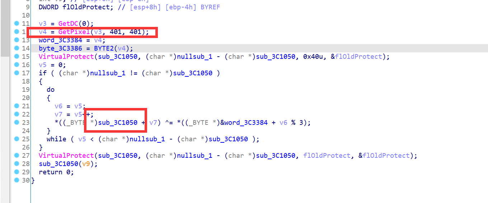

一般来说函数开头的汇编代码是固定的：

```asm
push	ebp
mov 	ebp, esp
```

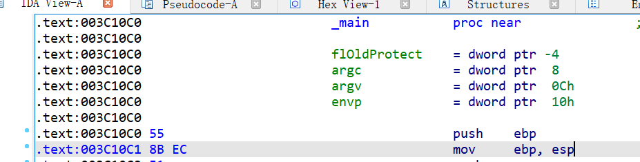

被加密的函数：

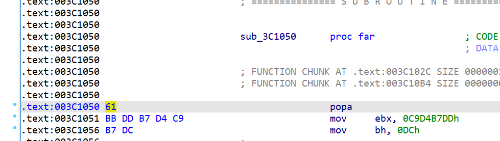

根据这个特征我们就能解出正确的RGB值为(0x34, 0x30, 0x31)：

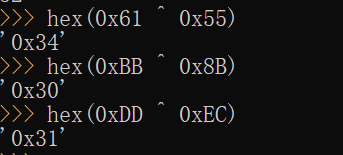

动态调试修改内存得到flag：

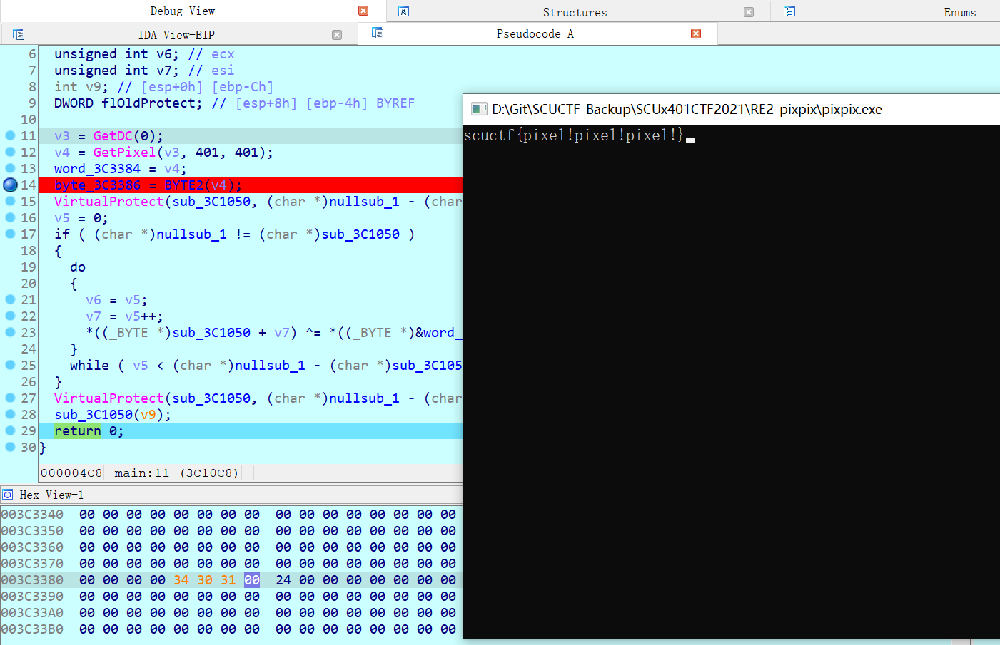

### RE3-rvm

简单的ruby逆向，是一个很简单的虚拟机，分析起来也很简单，只需要分析出每个opcode对应的指令格式即可。灵感来自国赛初赛一道很恶心的ruby逆向题，但难度要低很多。

直接在源码的基础上进行修改，解析shellcode：

```ruby
class RVM
    def initialize(shellcode)
        @PC = 0
        @FLAG = 1
        @shellcode = shellcode
        @reg = Array.new(27, 0)
    end

    def run
        begin 
            op = @shellcode[@PC]
            #ADD reg, imm
            op == "1" ? (puts "@reg[#{@shellcode[(@PC + 1)..(@PC + 2)].to_i}] += #{@shellcode[(@PC + 3)..(@PC + 4)].to_i}";@PC += 5) :
            #XOR reg, imm
            op == "2" ? (puts "@reg[#{@shellcode[(@PC + 1)..(@PC + 2)].to_i}] ^= #{@shellcode[(@PC + 3)..(@PC + 4)].to_i}";@PC += 5) :  
            #SUB reg, imm
            op == "3" ? (puts "@reg[#{@shellcode[(@PC + 1)..(@PC + 2)].to_i}] -= #{@shellcode[(@PC + 3)..(@PC + 4)].to_i}";@PC += 5) :  
            #WRITE imm.chr
            op == "4" ? (puts "STDOUT<<#{@shellcode[(@PC + 1)..(@PC + 3)].to_i.chr}";@PC += 4) :  
            #CMP
            op == "5" ? (puts "((@reg[#{@shellcode[(@PC + 1)..(@PC + 2)].to_i}] == #{@shellcode[(@PC + 3)..(@PC + 5)].to_i}) ? @FLAG &= 1 : @FLAG = 0)";@PC += 6) :
            #READ reg 
            op == "6" ? (puts "READ reg";@PC += 1) : 
            #JNZ 1
            op == "7" ? (puts "JNZ 1";@PC += 2) : ()
        end while @PC < @shellcode.length
    end

    def printreg
        puts @reg.inspect
    end

    def printflag
        puts @FLAG
    end

end

#scuctf{ruby_1s_y0ur_fr13nd}
rvm = RVM.new "40734110411241174116405861000110102102031030410405105061060710708108091091011011111121121311314114151151611617117181181911920120211212212223123241242512526126272004120161202762033420458205142060520798208392098421064211632126921314214522158621613217782187521987220802216522279223692247622502226765000935010885020525030695040675050985061355070245080895090565101965110845121235131435140905152235160765172015182065190365200435212015220075230145242035251245262127840794075"
rvm.run
```

得到：

```asm
STDOUT<<I
STDOUT<<n
STDOUT<<p
STDOUT<<u
STDOUT<<t
STDOUT<<:
READ reg
@reg[0] += 1
@reg[1] += 2
@reg[2] += 3
@reg[3] += 4
@reg[4] += 5
@reg[5] += 6
@reg[6] += 7
@reg[7] += 8
@reg[8] += 9
@reg[9] += 10
@reg[10] += 11
@reg[11] += 12
@reg[12] += 13
@reg[13] += 14
@reg[14] += 15
@reg[15] += 16
@reg[16] += 17
@reg[17] += 18
@reg[18] += 19
@reg[19] += 20
@reg[20] += 21
@reg[21] += 22
@reg[22] += 23
@reg[23] += 24
@reg[24] += 25
@reg[25] += 26
@reg[26] += 27
@reg[0] ^= 41
@reg[1] ^= 61
@reg[2] ^= 76
@reg[3] ^= 34
@reg[4] ^= 58
@reg[5] ^= 14
@reg[6] ^= 5
@reg[7] ^= 98
@reg[8] ^= 39
@reg[9] ^= 84
@reg[10] ^= 64
@reg[11] ^= 63
@reg[12] ^= 69
@reg[13] ^= 14
@reg[14] ^= 52
@reg[15] ^= 86
@reg[16] ^= 13
@reg[17] ^= 78
@reg[18] ^= 75
@reg[19] ^= 87
@reg[20] ^= 80
@reg[21] ^= 65
@reg[22] ^= 79
@reg[23] ^= 69
@reg[24] ^= 76
@reg[25] ^= 2
@reg[26] ^= 76
((@reg[0] == 93) ? @FLAG &= 1 : @FLAG = 0)
((@reg[1] == 88) ? @FLAG &= 1 : @FLAG = 0)
((@reg[2] == 52) ? @FLAG &= 1 : @FLAG = 0)
((@reg[3] == 69) ? @FLAG &= 1 : @FLAG = 0)
((@reg[4] == 67) ? @FLAG &= 1 : @FLAG = 0)
((@reg[5] == 98) ? @FLAG &= 1 : @FLAG = 0)
((@reg[6] == 135) ? @FLAG &= 1 : @FLAG = 0)
((@reg[7] == 24) ? @FLAG &= 1 : @FLAG = 0)
((@reg[8] == 89) ? @FLAG &= 1 : @FLAG = 0)
((@reg[9] == 56) ? @FLAG &= 1 : @FLAG = 0)
((@reg[10] == 196) ? @FLAG &= 1 : @FLAG = 0)
((@reg[11] == 84) ? @FLAG &= 1 : @FLAG = 0)
((@reg[12] == 123) ? @FLAG &= 1 : @FLAG = 0)
((@reg[13] == 143) ? @FLAG &= 1 : @FLAG = 0)
((@reg[14] == 90) ? @FLAG &= 1 : @FLAG = 0)
((@reg[15] == 223) ? @FLAG &= 1 : @FLAG = 0)
((@reg[16] == 76) ? @FLAG &= 1 : @FLAG = 0)
((@reg[17] == 201) ? @FLAG &= 1 : @FLAG = 0)
((@reg[18] == 206) ? @FLAG &= 1 : @FLAG = 0)
((@reg[19] == 36) ? @FLAG &= 1 : @FLAG = 0)
((@reg[20] == 43) ? @FLAG &= 1 : @FLAG = 0)
((@reg[21] == 201) ? @FLAG &= 1 : @FLAG = 0)
((@reg[22] == 7) ? @FLAG &= 1 : @FLAG = 0)
((@reg[23] == 14) ? @FLAG &= 1 : @FLAG = 0)
((@reg[24] == 203) ? @FLAG &= 1 : @FLAG = 0)
((@reg[25] == 124) ? @FLAG &= 1 : @FLAG = 0)
((@reg[26] == 212) ? @FLAG &= 1 : @FLAG = 0)
JNZ 1
STDOUT<<O
STDOUT<<K
```

还原成C语言的格式：

```cpp
unsigned char bv[27] = {41,61,76,34,58,14,5,98,39,84,64,63,69,14,52,86,13,78,75,87,80,65,79,69,76,2,76};
unsigned char enc[27] = {93, 88, 52, 69, 67, 98, 135, 24, 89, 56, 196, 84, 123, 143, 90, 223, 76, 201, 206, 36, 43, 201, 7, 14, 203, 124, 212};
unsigned char input[28] = {0};

scanf("%s", input);
for(int i = 0;i < 27;i ++){
    input[i] += i + 1;
    input[i] ^= bv[i];
}
if(!memcmp(input, bv)){
    printf("OK\n");
}
```

exp：

```cpp
#include <cstdio>
#include <cstring>

unsigned char bv[27] = {41,61,76,34,58,14,5,98,39,84,64,63,69,14,52,86,13,78,75,87,80,65,79,69,76,2,76};
unsigned char enc[27] = {93, 88, 52, 69, 67, 98, 135, 24, 89, 56, 196, 84, 123, 143, 90, 223, 76, 201, 206, 36, 43, 201, 7, 14, 203, 124, 212};

int main(){
    for(int i = 0;i < 27;i ++){
        enc[i] ^= bv[i];
        enc[i] -= i + 1;
    }
    printf("flag: %s\n", enc);
}
```

输出：

```
flag: scuctf{ruby_1s_y0ur_fr13nd}
```

### RE4-overflow

main函数的流程还是比较清晰的，输入经过了一个加密函数加密后再进行比较：

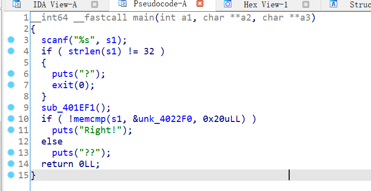

一个很明显的TEA：

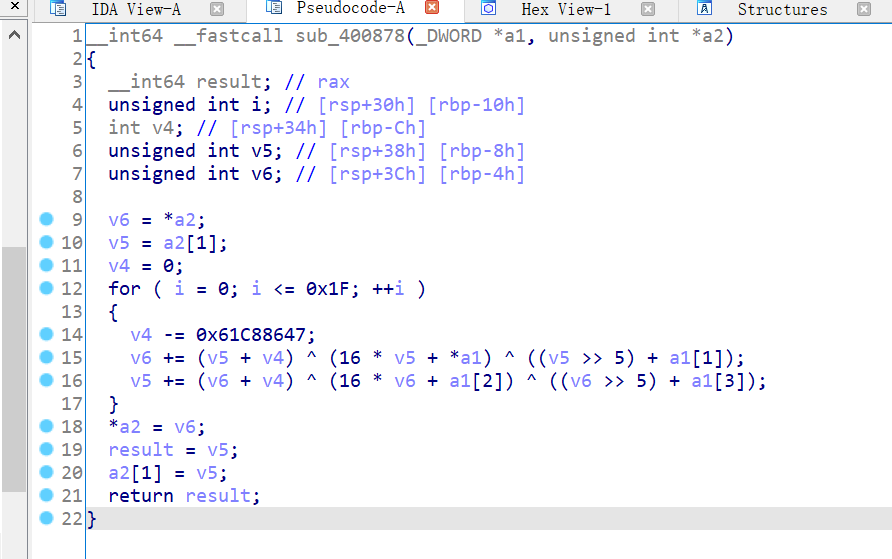

拷贝TEA的key，这里把32个字节拷贝到了16字节的数组里，rbp和函数返回地址被覆盖，因此会导致**栈溢出**：

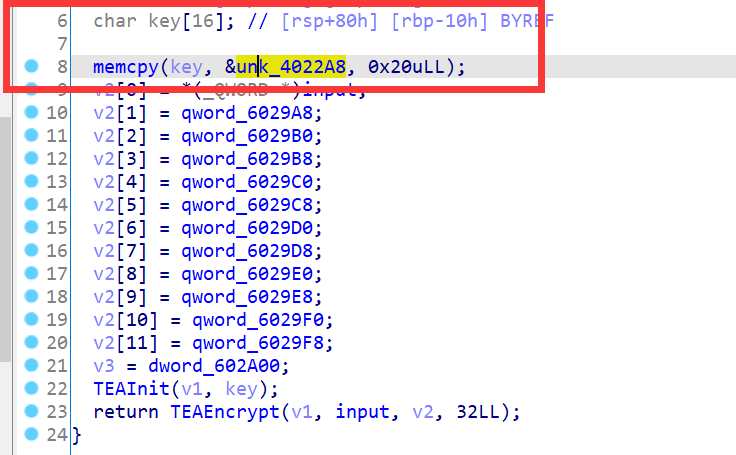

覆盖后的返回地址，在该函数结束后不会返回main函数，而是会跳转到sub_400DE3函数：

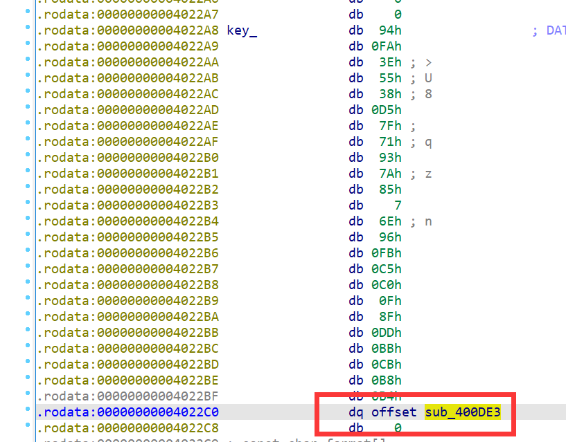

一个很明显的RC4：

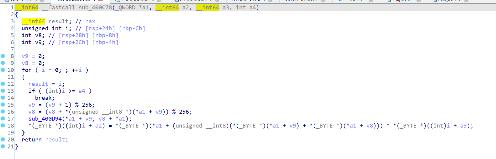

sub_400DE3函数的流程是先把TEA加密后的结果进行RC4加密，随后进行很多次两两交换（100次）：

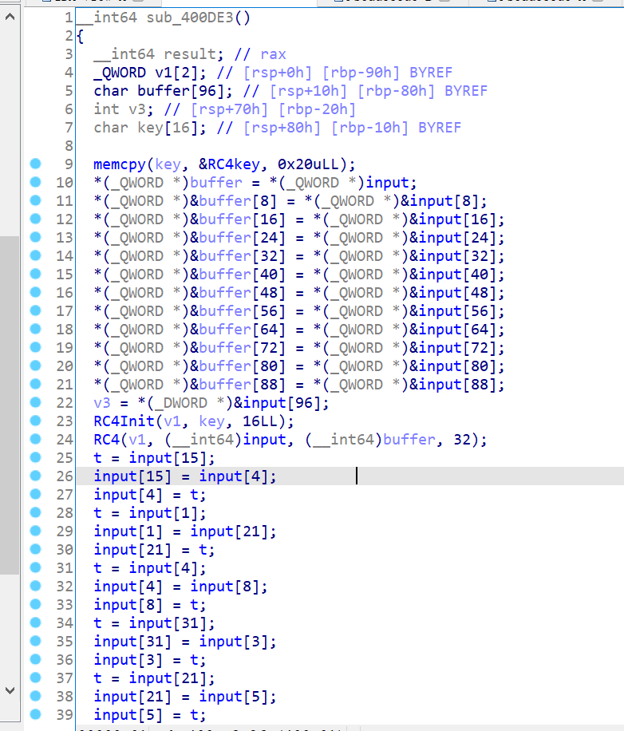

RC4很常规，至于两两交换的话有很多种解法：

1. 动态调试：交换前将input改为1..32的数字，查看交换后的数字分布得到交换前与交换后的映射关系。
2. angr/unicorn：符号执行/模拟执行这一段交换代码，得到映射关系
3. 直接把这一段伪代码复制之后执行

方法一得先去掉反调试：

在Ubuntu中用strace指令查看系统函数调用栈，发现在退出前调用了getppid这个函数：

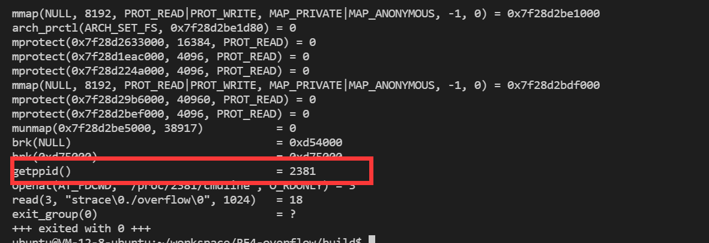

于是在IDA中通过getppid函数的交叉引用找到反调试代码，patch掉之后可以正常进行动态调试：

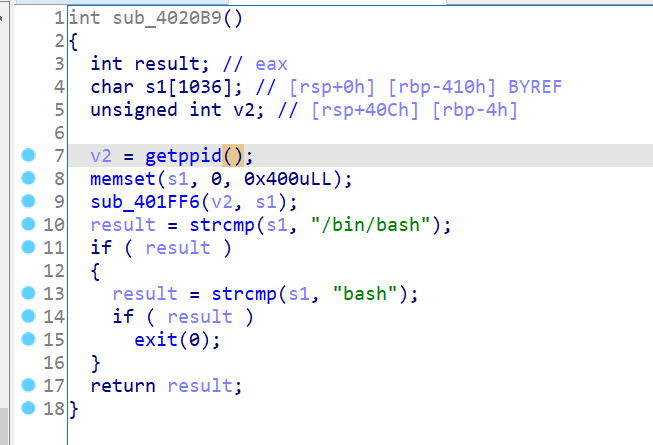

第二种方法是通过angr求出映射关系：

```python
import angr
import claripy

proj = angr.Project('./overflow', load_options={'auto_load_libs': False})
input_addr = 0x6029A0

table = claripy.BVS('table', 32 * 8)
state = proj.factory.blank_state(addr=0x400EEA)
for i in range(32):
    state.mem[input_addr + i].byte = i
simgr = proj.factory.simgr(state)
simgr.explore(find=0x401EF0)
found = simgr.found[0]
table = '['
for i in range(32):
    table += str(found.mem[input_addr + i].byte.concrete)
    table += ', ' if i != 31 else ']'
print(table)
```

求得映射关系：

```cpp
[24, 12, 18, 15, 11, 30, 27, 1, 19, 9, 23, 28, 22, 20, 4, 6, 26, 3, 31, 14, 25, 5, 0, 13, 8, 17, 7, 10, 2, 29, 16, 21]
```

完整exp：

```python
from Crypto.Cipher import ARC4
from binascii import a2b_hex, b2a_hex
from pytea import *

table = [24, 12, 18, 15, 11, 30, 27, 1, 19, 9, 23, 28, 22, 20, 4, 6, 26, 3, 31, 14, 25, 5, 0, 13, 8, 17, 7, 10, 2, 29, 16, 21]
enc = a2b_hex('7DB937E43FF10A83F555CA5C32D47D47180C21130D15F15B138B357B725D6237')
flag = bytearray()
for i in range(len(table)):
    flag.append(enc[table.index(i)])
flag = ARC4.new(key=a2b_hex('26148D621EF74844918AF182D63976B6')).decrypt(flag)
flag = TEA(key=a2b_hex('94FA3E5538D57F71937A85076E96FBC5')).Decrypt(flag)
print(flag)
```

flag：scuctf{y0u_4r3_r34l_pwn_y3y3!!!}

### RE5-baby_maze

根据提示，总共要解出100个迷宫，flag为100个迷宫路径的md5：

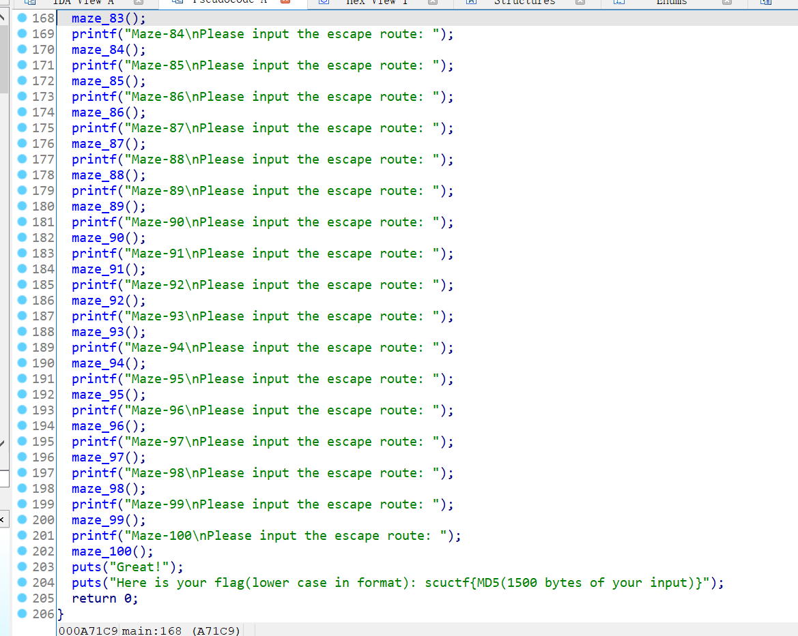

每个迷宫都经过了混淆，并且还插入了神奇的**rdrand rax**指令：

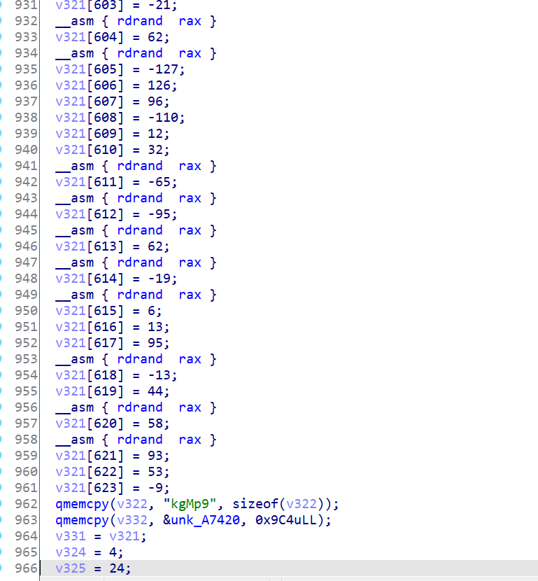

要人工解100个迷宫显然不可能，所以我们考虑使用angr求解。首先angr无法解析rdrand指令，编写idapython脚本去除rdrand指令：

```python
import idautils
from ida_bytes import patch_bytes
from idc import *

maze_list = []  #100个迷宫函数的地址
avoid_list = [] #100个迷宫函数中call exit的地址
retn_list = [] #100个迷宫函数的返回地址

for func_addr in idautils.Functions():
    func = idaapi.get_func(func_addr)
    ea = func_addr
    func_name = get_func_name(ea)
    if 'maze' in func_name:
        avoid = []
        while ea < func.end_ea:
            disasm = idc.GetDisasm(ea)
            if 'rdrand' in disasm:
                patch_bytes(ea - 1, b'\x90\x90\x90\x90\x90\x90') #去除rdrand指令
            if 'call' in disasm and 'exit' in disasm: #将call exit指令的地址添加到avoid_list
                avoid.append(ea + 0x400000)
            ea = idc.next_head(ea)
        maze_list.append(func.start_ea + 0x400000)
        avoid_list.append(avoid)
        retn_list.append(func.end_ea + 0x400000 - 1) #注意这里func.end_ea的值实际上是函数末尾地址+1，所以需要-1得到真正的末尾地址

print(f'maze_list={maze_list}\navoid_list={avoid_list}\nretn_list={retn_list}\n')
```

顺便把100个迷宫函数的地址、迷宫中**call exit**指令的地址、以及迷宫的返回地址求出来。

使用angr进行逐个迷宫求解，最后MD5得到flag：

```python
import angr
import claripy
from hashlib import md5
from binascii import b2a_hex

proj = angr.Project('./baby_maze', load_options={'auto_load_libs': False}) #加载二进制文件，auto_load_libs一定设置为False

all_route = b'' #记录所有的输入，最终为15 * 1000=1500个字节

maze_list=[4196234, 4203087, 4209886, 4216655, 4223358, 4230097, 4236842, 4243545, 4250494, 4257185, 4263972, 4270549, 4277276, 4284063, 4290826, 4297607, 4304478, 4311289, 4318124, 4324953, 4331908, 4338719, 4345530, 4352407, 4359152, 4365861, 4372648, 4379375, 4386216, 4393051, 4399868, 4406661, 4413466, 4420247, 4427052, 4433821, 4440626, 4447407, 4454206, 4460981, 4467786, 4474603, 4481342, 4488147, 4494910, 4501901, 4508640, 4515397, 4522184, 4528989, 4535914, 4542677, 4549524, 4556413, 4563128, 4569933, 4576678, 4583543, 4590312, 4597021, 4603766, 4610499, 4617370, 4624241, 4631058, 4637923, 4644872, 4651677, 4658446, 4665317, 4672086, 4678957, 4685858, 4692765, 4699606, 4706447, 4713348, 4720075, 4726730, 4733631, 4740490, 4747289, 4754118, 4760965, 4767680, 4774455, 4781320, 4788179, 4794984, 4801909, 4808756, 4815525, 4822384, 4829057, 4835868, 4842787, 4849592, 4856421, 4863322, 4870265]
avoid_list=[[4202842, 4203023], [4209641, 4209822], [4216410, 4216591], [4223113, 4223294], [4229852, 4230033], [4236597, 4236778], [4243300, 4243481], [4250249, 4250430], [4256940, 4257121], [4263727, 4263908], [4270304, 4270485], [4277031, 4277212], [4283818, 4283999], [4290581, 4290762], [4297362, 4297543], [4304233, 4304414], [4311044, 4311225], [4317879, 4318060], [4324708, 4324889], [4331663, 4331844], [4338474, 4338655], [4345285, 4345466], [4352162, 4352343], [4358907, 4359088], [4365616, 4365797], [4372403, 4372584], [4379130, 4379311], [4385971, 4386152], [4392806, 4392987], [4399623, 4399804], [4406416, 4406597], [4413221, 4413402], [4420002, 4420183], [4426807, 4426988], [4433576, 4433757], [4440381, 4440562], [4447162, 4447343], [4453961, 4454142], [4460736, 4460917], [4467541, 4467722], [4474358, 4474539], [4481097, 4481278], [4487902, 4488083], [4494665, 4494846], [4501656, 4501837], [4508395, 4508576], [4515152, 4515333], [4521939, 4522120], [4528744, 4528925], [4535669, 4535850], [4542432, 4542613], [4549279, 4549460], [4556168, 4556349], [4562883, 4563064], [4569688, 4569869], [4576433, 4576614], [4583298, 4583479], [4590067, 4590248], [4596776, 4596957], [4603521, 4603702], [4610254, 4610435], [4617125, 4617306], [4623996, 4624177], [4630813, 4630994], [4637678, 4637859], [4644627, 4644808], [4651432, 4651613], [4658201, 4658382], [4665072, 4665253], [4671841, 4672022], [4678712, 4678893], [4685613, 4685794], [4692520, 4692701], [4699361, 4699542], [4706202, 4706383], [4713103, 4713284], [4719830, 4720011], [4726485, 4726666], [4733386, 4733567], [4740245, 4740426], [4747044, 4747225], [4753873, 4754054], [4760720, 4760901], [4767435, 4767616], [4774210, 4774391], [4781075, 4781256], [4787934, 4788115], [4794739, 4794920], [4801664, 4801845], [4808511, 4808692], [4815280, 4815461], [4822139, 4822320], [4828812, 4828993], [4835623, 4835804], [4842542, 4842723], [4849347, 4849528], [4856176, 4856357], [4863077, 4863258], [4870020, 4870201], [4876723, 4876904]]
retn_list=[4203086, 4209885, 4216654, 4223357, 4230096, 4236841, 4243544, 4250493, 4257184, 4263971, 4270548, 4277275, 4284062, 4290825, 4297606, 4304477, 4311288, 4318123, 4324952, 4331907, 4338718, 4345529, 4352406, 4359151, 4365860, 4372647, 4379374, 4386215, 4393050, 4399867, 4406660, 4413465, 4420246, 4427051, 4433820, 4440625, 4447406, 4454205, 4460980, 4467785, 4474602, 4481341, 4488146, 4494909, 4501900, 4508639, 4515396, 4522183, 4528988, 4535913, 4542676, 4549523, 4556412, 4563127, 4569932, 4576677, 4583542, 4590311, 4597020, 4603765, 4610498, 4617369, 4624240, 4631057, 4637922, 4644871, 4651676, 4658445, 4665316, 4672085, 4678956, 4685857, 4692764, 4699605, 4706446, 4713347, 4720074, 4726729, 4733630, 4740489, 4747288, 4754117, 4760964, 4767679, 4774454, 4781319, 4788178, 4794983, 4801908, 4808755, 4815524, 4822383, 4829056, 4835867, 4842786, 4849591, 4856420, 4863321, 4870264, 4876967]
for i in range(100):
    addr = maze_list[i]
    print(i + 1)
    route = claripy.BVS('route', 15 * 8) #将输入长度约束为15字节
    state = proj.factory.blank_state(addr=addr, stdin=route)
    for j in range(15):
        b = route.get_byte(j)
        state.solver.add(b >= 33) #将输入约束为可见的ascii字符
        state.solver.add(b <= 126)
    simgr = proj.factory.simgr(state)
    simgr.explore(find=retn_list[i], avoid = avoid_list[i]) #开始符号执行
    single_route = simgr.found[0].posix.dumps(0)
    all_route += single_route
    print(f'Found route: {single_route.decode()}')

print(all_route)
digest = b2a_hex(md5(all_route).digest()).decode()
print(f'scuctf{{{digest}}}')
```

其实angr脚本可以不这么复杂，更简单的版本参考**马猴烧酒**战队的WP。

大概十分钟左右能跑完一百个迷宫：

scuctf{60e925573e0c31236eb1c57005fc0655}

### RE6-twin

RE6主要考察选手对Linux进程调度、进程通信的理解，以及AES中一些简单的矩阵运算和有限域下的矩阵方程求解。

首先创建了两个pipe，用于父进程和子进程的通信。pipe[0]是读管道，pipe[1]是写管道，所以要实现父进程和子进程的互相通信必须创建两个管道：

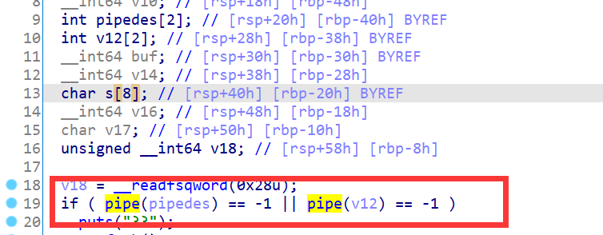

随后通过fork函数创建子进程，在父进程中，fork函数的返回值为子进程ppid，子进程中fork函数的返回值为0，以此区分父子进程：

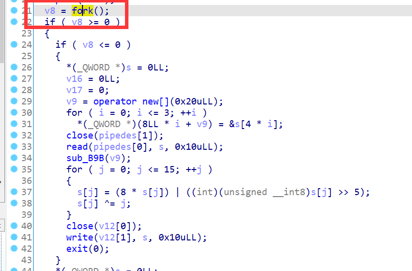

首先看到父进程逻辑，父进程读取长度为16的输入：

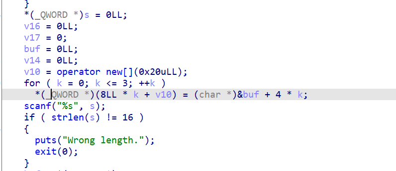

经过sub_A8A函数加密后将加密结果通过pipe和write函数传给子进程，调用wait函数等待子进程执行完毕：

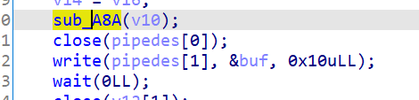

sub_A8A函数中是一个很简单的字节替换，对应AES中的SubBytes，S_BOX为AES中的S_BOX，因此在求逆时可以直接把AES中的INV_S_BOX复制下来：

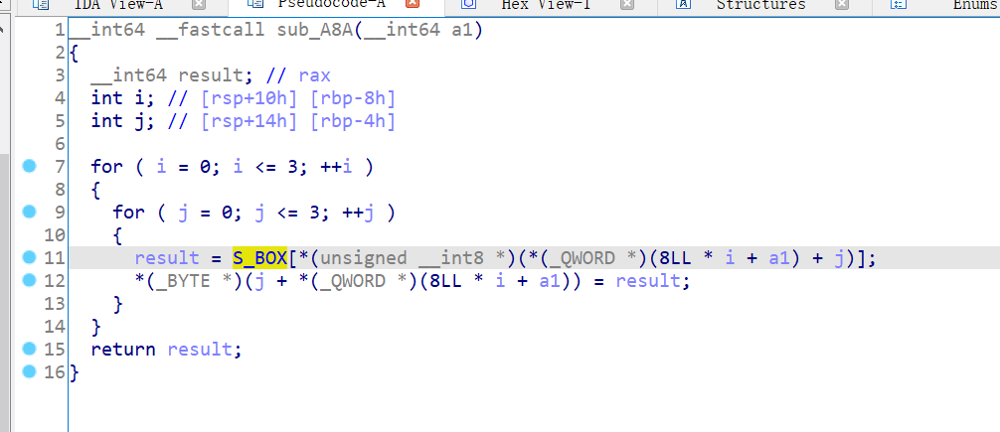

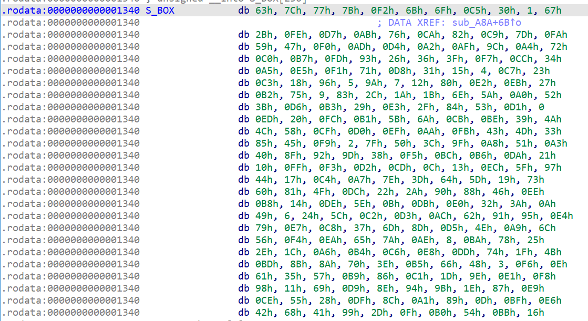

随后进入子进程，子进程从管道中读取数据后调用sub_B9B函数进行加密：

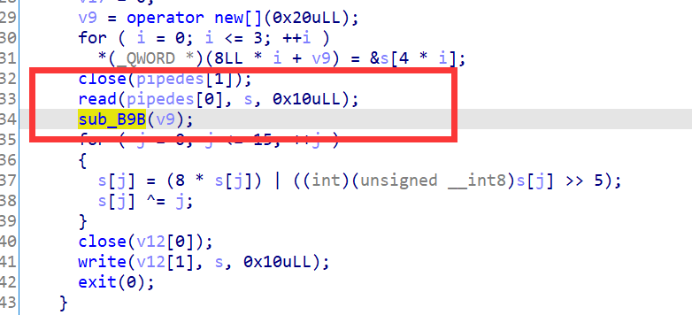

sub_B9B函数对应AES中的行移位变换，即ShiftRows，将4*4矩阵的第i行循环左移i-1：

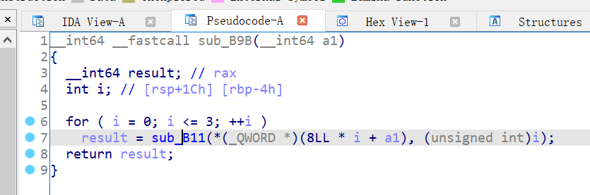

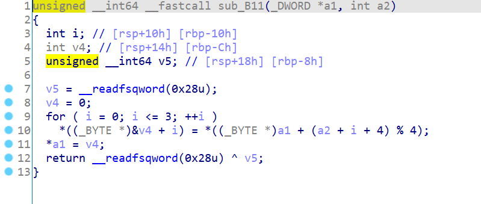

再进行一个简单的加密后将加密结果写入管道，子进程结束：

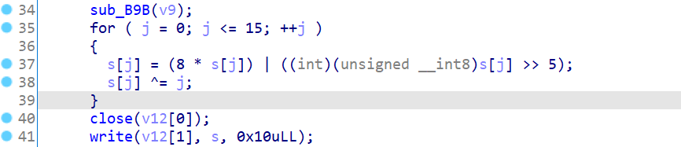

继续返回父进程执行，父进程从管道中读取子进程加密结果，随后经过sub_BE1函数进行加密，最后与密文进行比较：

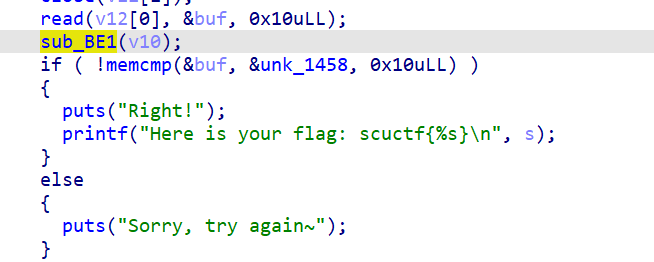

sub_BE1函数是一个模251的矩阵乘法，即有限域GF(251)下的矩阵乘法：

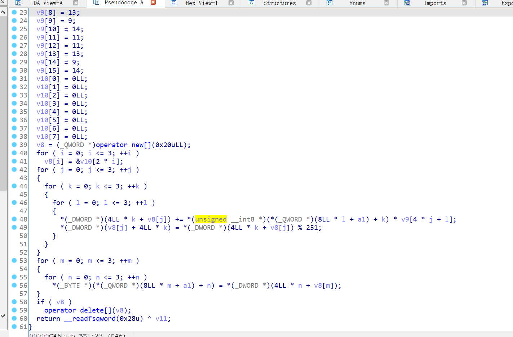

有限域下的矩阵方程可以通过sagemath求解，在Ubuntu中安装sagemath/sagemath Docker，使用以下代码求解矩阵方程：

```python
M = Matrix(GF(251), [[14, 11, 13, 9], [9, 14, 11, 13], [13, 9, 14, 11], [11, 13, 9, 14]])
cipher = Matrix(GF(251), [[140, 28, 22, 124],[170, 40, 21, 141],[77, 26, 142, 169],[239, 167, 71, 204]])
print(M.solve_right(cipher))
```

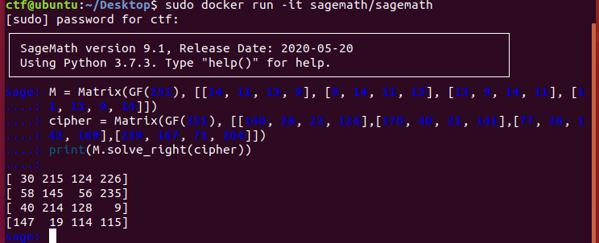

随后用C++写出exp：

```cpp
#include <cstdio>
#include <cstring>
#define BYTE unsigned char

const BYTE INV_S_BOX[] = {
    0x52, 0x09, 0x6a, 0xd5, 0x30, 0x36, 0xa5, 0x38, 0xbf, 0x40, 0xa3, 0x9e, 0x81, 0xf3, 0xd7, 0xfb,
    0x7c, 0xe3, 0x39, 0x82, 0x9b, 0x2f, 0xff, 0x87, 0x34, 0x8e, 0x43, 0x44, 0xc4, 0xde, 0xe9, 0xcb,
    0x54, 0x7b, 0x94, 0x32, 0xa6, 0xc2, 0x23, 0x3d, 0xee, 0x4c, 0x95, 0x0b, 0x42, 0xfa, 0xc3, 0x4e,
    0x08, 0x2e, 0xa1, 0x66, 0x28, 0xd9, 0x24, 0xb2, 0x76, 0x5b, 0xa2, 0x49, 0x6d, 0x8b, 0xd1, 0x25,
    0x72, 0xf8, 0xf6, 0x64, 0x86, 0x68, 0x98, 0x16, 0xd4, 0xa4, 0x5c, 0xcc, 0x5d, 0x65, 0xb6, 0x92,
    0x6c, 0x70, 0x48, 0x50, 0xfd, 0xed, 0xb9, 0xda, 0x5e, 0x15, 0x46, 0x57, 0xa7, 0x8d, 0x9d, 0x84,
    0x90, 0xd8, 0xab, 0x00, 0x8c, 0xbc, 0xd3, 0x0a, 0xf7, 0xe4, 0x58, 0x05, 0xb8, 0xb3, 0x45, 0x06,
    0xd0, 0x2c, 0x1e, 0x8f, 0xca, 0x3f, 0x0f, 0x02, 0xc1, 0xaf, 0xbd, 0x03, 0x01, 0x13, 0x8a, 0x6b,
    0x3a, 0x91, 0x11, 0x41, 0x4f, 0x67, 0xdc, 0xea, 0x97, 0xf2, 0xcf, 0xce, 0xf0, 0xb4, 0xe6, 0x73,
    0x96, 0xac, 0x74, 0x22, 0xe7, 0xad, 0x35, 0x85, 0xe2, 0xf9, 0x37, 0xe8, 0x1c, 0x75, 0xdf, 0x6e,
    0x47, 0xf1, 0x1a, 0x71, 0x1d, 0x29, 0xc5, 0x89, 0x6f, 0xb7, 0x62, 0x0e, 0xaa, 0x18, 0xbe, 0x1b,
    0xfc, 0x56, 0x3e, 0x4b, 0xc6, 0xd2, 0x79, 0x20, 0x9a, 0xdb, 0xc0, 0xfe, 0x78, 0xcd, 0x5a, 0xf4,
    0x1f, 0xdd, 0xa8, 0x33, 0x88, 0x07, 0xc7, 0x31, 0xb1, 0x12, 0x10, 0x59, 0x27, 0x80, 0xec, 0x5f,
    0x60, 0x51, 0x7f, 0xa9, 0x19, 0xb5, 0x4a, 0x0d, 0x2d, 0xe5, 0x7a, 0x9f, 0x93, 0xc9, 0x9c, 0xef,
    0xa0, 0xe0, 0x3b, 0x4d, 0xae, 0x2a, 0xf5, 0xb0, 0xc8, 0xeb, 0xbb, 0x3c, 0x83, 0x53, 0x99, 0x61,
    0x17, 0x2b, 0x04, 0x7e, 0xba, 0x77, 0xd6, 0x26, 0xe1, 0x69, 0x14, 0x63, 0x55, 0x21, 0x0c, 0x7d
};

void InvSubBytes(BYTE **state){
    for(int i = 0;i < 4;i ++){
        for(int j = 0;j < 4;j ++){
            state[i][j] = INV_S_BOX[state[i][j]];
        }
    }
}

void ShiftRow(BYTE *row, int n){
    BYTE temp[4] = {0};
    for(int i = 0;i < 4;i ++){
        temp[i] = row[(i + 4 + n) % 4];
    }
    memcpy(row, temp, 4);
}

void InvShiftRows(BYTE **state){
    for(int i = 0;i < 4;i ++){
        ShiftRow(state[i], -i);
    }
}

/*
M = Matrix(GF(251), [[14, 11, 13, 9], [9, 14, 11, 13], [13, 9, 14, 11], [11, 13, 9, 14]])
cipher = Matrix(GF(251), [[140, 28, 22, 124],[170, 40, 21, 141],[77, 26, 142, 169],[239, 167, 71, 204]])
print(M.solve_right(cipher))
[ 30 215 124 226]
[ 58 145  56 235]
[ 40 214 128   9]
[147  19 114 115]
*/
int main(){
    BYTE encFlag[17] = {30, 215, 124, 226, 58, 145, 56, 235, 40, 214, 128, 9, 147, 19, 114, 115, 0};
    BYTE **state = new BYTE*[4];
    for(int i = 0;i < 4;i ++){
        state[i] = encFlag + 4 * i;
    }
    for(int i = 0;i < 16;i ++){
        encFlag[i] ^= i;
        encFlag[i] = (encFlag[i] >> 3) | (encFlag[i] << 5);
    }
    InvShiftRows(state);
    InvSubBytes(state);
    printf("flag: scuctf{%s}\n", encFlag);
}
```

运行得到flag：scuctf{3z_mu1t1pr0c3ss~}

